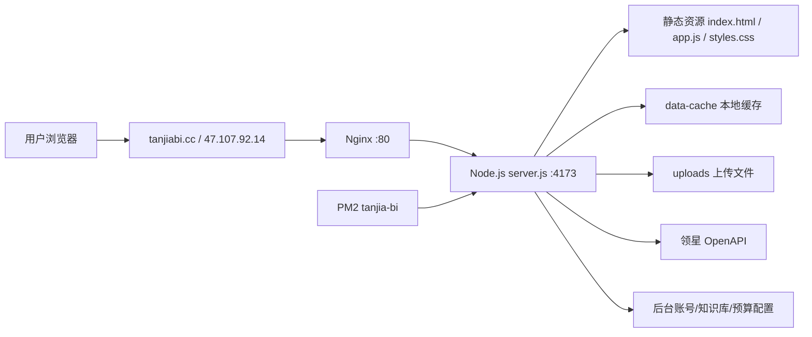

# 探嘉 BI 唯一设计规范

更新时间：2026-07-30

本文档是探嘉 BI 的唯一主规范，合并了原 `DESIGN_SYSTEM.md` 与 `UI_DESIGN_README.md` 的有效内容。后续产品设计、UI 调整、前后端实现、权限、部署和验收都以本文档为准。

## 1. 系统定位

探嘉 BI 是面向跨境电商运营团队的业务分析与自动化辅助系统。系统聚合领星 ERP、广告、库存、采购、财务和内部配置数据，为运营负责人提供销售复盘、即时表现、广告复盘、预算目标、FBA 刷仓、销售预估、采购看板、库存风险、财务回款和同步状态等工作台能力。

当前项目形态：

| 层级 | 当前方案 |
| --- | --- |
| 前端 | 原生 HTML、CSS、JavaScript 单页应用 |
| 设计系统 | Adobe React Spectrum 原则 + 探嘉 BI 项目视觉规则 |
| 后端 | Node.js HTTP 服务 |
| 运行 | PM2 托管 Node 服务，Nginx 反向代理 |
| 数据 | 优先读取领星 ERP 同步结果和本地缓存，缺失时用 mock 或空态兜底 |
| 部署 | 本地生成 `tanjia-bi-deploy.tar.gz`，Codex 通过 SSH 直接部署到服务器 |

设计目标：

- 用一个 BI 工作台集中呈现销售、库存、采购、财务、广告和同步状态。
- 保持后台系统的信息密度，让运营人员可以长时间扫描和复盘。
- 弱化导航区域，突出内容区域。
- 支持每 12 小时自动同步，也支持手动同步。
- 保留本地缓存，让外部 API 波动时仍可展示最近可用数据。
- 通过角色控制隐藏敏感模块，尤其是财务和后台管理。
- 保持部署、回退和小步迭代简单。

非目标：

- 当前不是完整数据仓库系统。
- 当前不承诺所有数据实时刷新。
- 当前不做复杂多租户隔离。
- 当前不引入前端框架，除非后续明确重构。
- 当前不强制 Git 拉取部署，仍以部署包为主。

## 2. 主要设计参考

视觉参考以 Dub 的 light SaaS / compact dashboard 风格为主，但不照搬。

吸收 Dub 的部分：

- 浅灰工作区。
- 白色内容块。
- 低阴影或无阴影。
- 紧凑信息密度。
- 单一蓝色强调。
- 统一圆角和控件尺寸。
- 文本、按钮和状态层级克制。

不吸收 Dub 的部分：

- 不把所有白色内容块都改成明显 1px 边框。
- 不把探嘉 BI 改成营销官网式 SaaS 首页。
- 不引入新的大面积品牌色或装饰图形。
- 不降低当前 BI 表格、筛选和指标页的信息密度。

设计基准：

- Adobe React Spectrum 提供组件交互、可访问性、语义 token 和状态完整性原则。
- Dub 提供白灰、紧凑、克制的视觉参考。
- 探嘉 BI 当前已确认的 sidebar、topbar、面包屑、权限和业务信息架构优先级最高。

## 3. 页面气质

探嘉 BI 要表达的是：

- 稳定：用户相信数据、状态和权限是可靠的。
- 清晰：页面结构和指标关系一眼可扫。
- 克制：不靠装饰、渐变、强投影制造设计感。
- 高效：常用筛选、表格、告警和同步状态优先可见。
- 专业：符合跨境电商运营、采购、财务和管理场景，不像营销官网。

视觉关键词：

```text
light dashboard / compact SaaS / calm operations console / white content on gray workspace
```

页面不追求：

- 炫技感。
- 过度品牌化。
- 大面积插画。
- 营销式 hero。
- 一屏只展示少量内容的“展示页”气质。

## 4. 颜色

### 当前 CSS 迁移状态

CSS 只有一个最终标准：`styles.css` 由 `assets/css/*` 分层源生成。

当前分层源已经通过截图验收复现 sidebar、topbar 与核心页面基线；`styles.css` 是可由 `assets/css/*` 重新生成的视觉基线，不再作为手工锁定文件维护。

规则：

- 不要手工编辑 `styles.css`。
- CSS 改动先编辑 `assets/css/*`，再运行 `npm run build:css`。
- 不要在无视觉验收的情况下改变 sidebar 图标尺寸、topbar/sidebar 关系、筛选栏密度、表格行高或弹窗结构。
- CSS 结构治理可以继续，但必须以 `docs/visual-baseline/` 截图为回归基准，做到“拆结构，不改观感”。
- 共享控件、表格、面板和弹窗使用 `--tj-control-height`、`--tj-control-height-compact`、`--tj-control-radius`、`--tj-panel-radius`、`--tj-modal-radius`、`--tj-table-row-hover-bg` 和 `--tj-focus-ring` 作为视觉基线；页面级 CSS 不应重新定义这些基础尺寸。

长期目标仍然是下方的现代 light dashboard 基线：单一蓝色强调、语义 token、减少渐变和硬编码色。迁移时先保证视觉等价，再逐步收敛这些现代化指标。

颜色原则：

- 整体基调是浅灰工作区 + 白色内容块 + 蓝色交互强调。
- 只允许一个主强调色：蓝色。
- 状态色只用于小面积标签、数字、图表和告警，不允许成为页面主色。
- 不在不同页面引入随机色值。
- 不使用大面积深色导航背景，除非未来整套视觉重新确认。

核心 token：

```css
--tj-shell-bg: #eceef3;
--tj-page-bg: #eceef3;
--tj-bar-bg: #eceef3;
--tj-topbar-bg: #eceef3;
--tj-content-bg: #ffffff;
--tj-action-blue: #1677ff;
--tj-action-blue-hover: #0f66dd;
--tj-action-blue-soft: #eaf4ff;
--tj-text-strong: #111827;
--tj-text-body: #344054;
--tj-text-muted: #687386;
--tj-border-subtle: #e5e7eb;
--tj-border-control: #cdd8e6;
--tj-positive: #16a34a;
--tj-warning: #f97316;
--tj-danger: #ef4444;
```

使用规则：

| 场景 | 颜色规则 |
| --- | --- |
| sidebar / topbar / 工作区 | 使用同一浅灰 |
| 内容 banner / 筛选栏 / 表格容器 / 图表区 | 白色 |
| 当前导航、主按钮、重点路径 | 蓝色 |
| 辅助文字、路径非当前层级 | muted 灰 |
| 成功、预警、错误 | 小面积状态色 + 文案或图标 |
| 输入框边框、表格分隔 | 低对比浅灰或浅蓝灰 |

禁止：

- 大面积紫色、紫蓝渐变、橙色、绿色或黑色导航。
- 一个页面里多个互相竞争的强调色。
- 为了“好看”新增一次性颜色。
- 只靠颜色表达状态，必须配合文字、图标或形状。

## 5. 字体

字体原则：

- 使用系统 UI 字体栈，不引入新字体依赖。
- 中文和数字都要适合长时间阅读。
- Windows 上字体渲染会偏粗，因此字重必须克制。
- 当前页强调不靠大字号，靠颜色和轻微字重。

推荐字体栈：

```css
font-family: Inter, ui-sans-serif, system-ui, -apple-system, BlinkMacSystemFont, "Segoe UI", sans-serif;
```

字号和字重：

| 场景 | 字号 | 字重 | 说明 |
| --- | --- | --- | --- |
| 页面主标题 | 22px - 26px | 700 - 780 | 只用于内容 banner 标题 |
| 面包屑 | 13px | 600 - 720 | 当前页轻微加粗 |
| 主导航 | 14px - 15px | 600 - 650 | 主菜单略大于子菜单 |
| 子菜单 | 12px - 13px | 400 - 520 | 字重偏轻，避免拥挤 |
| 卡片标题 | 15px - 17px | 650 - 720 | 不做大标题 |
| 正文说明 | 13px - 14px | 400 - 500 | 行高 1.45 - 1.65 |
| 表格单元格 | 12px - 13px | 400 - 520 | 数字使用 tabular-nums |
| 按钮文字 | 13px - 14px | 600 - 700 | 保持一行 |

表格列类型契约：

- 新增数据表的数字、金额、百分比列优先在表头声明 `data-column-kind="number"`，或用 `data-column-type="money"` / `data-column-type="percent"` 等语义类型；表格管理器会先尊重显式声明，再使用表头文案推断作为旧表格兼容兜底。
- 表格基线样式分两层：`assets/css/components/45-table-controls.css` 提供共享表格组件规则，`assets/css/final/90-table-invariants.css` 位于 page/legacy 之后，只放产品级不变量，例如数字列右对齐、`tabular-nums`、状态行对齐和列宽调整手柄基础交互。
- 所有页面视图内的 BI 表格默认由 `assets/js/data-table-manager.js` 管理，并必须使用共享智能列宽。管理器按列语义和前 30 行业务数据的 90 分位计算列宽，并优先保留当前浏览器中用户手动调整的宽度。
- 所有由 `assets/js/data-table-manager.js` 管理的 BI 表格叶子表头默认都有共享排序 icon。普通表头由管理器自动生成 `.sort-button` 并走通用表格排序；MSKU 明细、供应商看板、工厂库存等业务专用排序按钮继续声明自己的 `data-*-sort` 并复用同一 `.sort-button` 视觉规则。icon 右侧必须贴近列分割线，默认 `right: 1px`，选中排序状态不得额外扩大表头 padding。
- 宽度来源优先级固定为：用户保存宽度、经过审查的 `data-column-width`、共享智能计算、通用文本兜底。用户可通过表格内的“恢复智能列宽”只重置当前表。
- 页面 CSS 可以保留矩阵表的 sticky、分组表头、图片框、tooltip、行密度和容器布局等页面专属视觉，但不得给普通业务列设置固定 `width` / `min-width`，不得用 `nth-child` 给列设宽，也不得重新定义普通 `th` / `td` 的左右对齐。文本列默认左对齐，数字列由 `.table-cell--number` 统一右对齐。
- 选择、图片、数字、金额/费率、短名称、标识符、单号、长名称、说明和操作列必须使用共享语义 profile。语义无法由列名稳定推断时，在表头补充 `data-column-profile`，不在页面 CSS 中增加像素补丁。
- 窄视口不得因表格给 `body`、`.app-shell`、`.dashboard` 或页面视图设置全局固定 `min-width`。页面本身必须保持视口宽度，横向浏览仅由对应 `.table-wrap` 容器承担。
- 需要整表垂直居中的表格使用 `.data-table--middle`；需要可滚动明细表的统一 sticky 表头、分隔和排序按钮样式时，使用 `.data-table-wrap--detail` 与 `.data-table--detail`。这些属于共享组件能力，不在 page CSS 或 legacy CSS 重复实现。
- 完整的 profile 范围、采样算法、持久化迁移、诊断和验收标准以 `docs/superpowers/specs/2026-07-21-shared-smart-table-width-design.md` 为准；`design.md` 只保留所有页面必须遵守的设计约束。

筛选栏契约：

- 普通筛选栏统一使用 `.filters`，紧凑工具筛选栏统一使用 `.filter-toolbar`；新增筛选区必须复用这两个共享类，不新增页面私有筛选栏基线。
- 筛选栏容器使用白底、无外层实线框、`column-gap: 8px`、`row-gap: 8px`、`min-height: 48px`、`padding: 8px 10px`。输入框、下拉、日期按钮自身保留浅边框。
- 控件高度统一用 `--tj-control-height-compact`，圆角用 `--tj-control-radius`，字号 13px，focus 使用 `--tj-focus-ring`。
- `.filters` 默认字段宽度为 116px，日期字段 240px，搜索字段 220px；`.filter-toolbar` 默认字段宽度为 150px，日期字段 240px，直接 search 输入 180px，按钮宽度按内容自适应。
- 当 .filters 或 .filter-toolbar 紧跟 .module-hero 后面时，筛选栏必须使用共享 sticky 规则固定在 topbar 下方；页面 CSS 不得为单个板块重复写 sticky 筛选栏规则。
- 所有当前站点的读取型 `/api/*` 请求都由 `assets/js/dashboard-loader.js` 的全局页面加载器统一呈现。请求超过 300ms 时，只在当前活动页面的数据区显示遮罩、状态文案与进度条；侧边栏、顶部栏和筛选栏保持可操作。加载器优先使用 `.dashboard-loading-scope`，否则从当前页面首个筛选栏下方开始覆盖；已使用 `loadDashboardSection()` 的模块不得另行产生第二层遮罩。
- checkbox 型筛选使用 `.checkbox-label`，由共享筛选栏规则统一控制字号、间距和 checkbox 尺寸。
- 页面级 CSS 不允许重新定义 `.filters` / `.filter-toolbar` / `*-filters` / `*-toolbar` 的 `display`、`grid-template-*`、`gap`、`padding`、`border`、控件高度、控件边框、focus 样式或日期控件宽度。页面可以控制筛选栏是否显示，也可以调整所在业务面板、KPI、表格和图表布局。
- 结构测试会扫描 page CSS，防止新页面继续用页面私有规则覆盖共享筛选栏基线。

日期控件契约：

- 新增日期范围筛选优先使用 `assets/js/date-range-picker.js` 和 `assets/css/components/36-date-range-picker.css` 的共享双月日期控件。
- 默认展开视图是前 30 天到今天；开始日期选中后，结束日期只能在开始日期起 30 天内，并且不能超过今天。
- 日期弹层宽度为 `min(760px, 96vw)`，左侧快捷项宽度 112px；快捷项 hover/focus 使用淡蓝底。
- 选中开始/结束日期使用蓝色圆形填充，今天使用蓝色细圆边框，范围预览使用淡蓝底。
- 日期按钮不使用额外伪元素图标；弹层必须显式设置字体大小，不能继承外层 label 的隐藏文字规则。

禁止：

- 导航和表格使用过高字重。
- 页面标题做成营销页 hero 级大字。
- 当前页路径字号大于其他层级。
- 按钮文字在桌面端换行。

## 6. 首屏布局

首屏要表达“这是一个可以直接工作的运营 BI”，而不是展示型页面。

固定结构：

```text
sidebar + topbar + content workspace
```

topbar：

- 固定在顶部，页面滚动时不消失。
- 背景与 sidebar、工作区保持同一浅灰。
- 左上角品牌为 `joimew logo + 探嘉 BI`。
- 右侧展示世界时间、同步状态和登录用户。
- 面包屑放在 topbar 第二行或靠近内容区的固定位置。
- 面包屑左边缘必须与当前页面第一张白色 banner 左边缘对齐。

sidebar：

- 展开态宽度保持紧凑。
- 折叠态保留图标和文字。
- 首页与其他一级板块尺寸一致，不做超大入口。
- 点击一级板块只展开对应分组，不直接跳转。
- 折叠态点击主菜单弹出浮层子菜单，不自动展开 sidebar。
- 只有点击 sidebar 底部箭头才展开或折叠。

内容区首屏：

1. 第一张白色 banner：当前页面标题 + 一句短说明 + 必要操作。
2. 筛选栏：紧跟内容 banner，不跑到 topbar 上方。
3. 核心指标：销售、利润、广告、履约、库存、净利等。
4. 主图表或主表格：展示当前页面最重要的数据。
5. 右侧或下方辅助卡片：提醒、同步状态、待处理事项。

首页首屏：

- 默认进入首页。
- 首页是 BI 总览仪表盘，不做营销欢迎页。
- 首屏优先展示核心经营状态、同步状态、异常提醒和核心子页面入口。
- 对无财务权限用户，不展示财务敏感卡片。

## 7. 按钮样式

按钮必须服务操作层级，不能到处都是蓝色。

按钮类型：

| 类型 | 用途 | 样式 |
| --- | --- | --- |
| 主按钮 | 查询、同步、保存、登录等关键动作 | 蓝底白字 |
| 次按钮 | 导出、取消、查看、重置等辅助动作 | 白底或透明底，低对比边界 |
| 文本按钮 | 表格内查看、跳转、轻量操作 | 蓝色文字或 muted 文字 |
| 危险按钮 | 删除、解绑、清空等不可逆动作 | 红色小面积表达，必要时确认 |

尺寸规则：

- 桌面按钮高度默认 32px - 36px。
- 触摸设备可提升到 40px。
- 圆角默认 8px。
- 主按钮同一视区不要超过 1 - 2 个。
- 按钮文字必须一行显示。
- 图标按钮必须有 `aria-label`。

状态规则：

- hover：颜色轻微加深或背景轻微变浅。
- active：允许 1px 位移或轻微压下感。
- focus：必须有可见焦点态。
- disabled：降低对比但仍可读。
- loading：按钮文案变为具体状态，例如“同步中”，不只显示 spinner。

禁止：

- 一页多个同等醒目的大蓝按钮。
- 白底白字、浅蓝底浅字等低对比按钮。
- 没有 label 的纯图标按钮。
- 为单一页面新增孤立按钮颜色。

## 8. 卡片与内容块

探嘉 BI 的内容块不是营销卡片。它们要承载数据、筛选、表格和状态。

内容块规则：

- 白色内容块默认不加明显边框，维持当前 BI 的干净状态。
- 层级主要依靠工作区浅灰背景、区块间距、圆角和轻微背景差异表达。
- 只有输入框、表格分隔、弹层、浮层、特殊状态容器需要明显边界。
- 不使用大面积重阴影。
- 不使用嵌套卡片套卡片。
- 卡片圆角保持克制，默认约 10px - 12px。

区块间距：

- 内容区块之间必须有清晰间距，不能粘连。
- 指标卡之间间距 10px - 14px。
- 页面主内容纵向间距 12px - 16px。
- 表格和筛选栏要比营销页面更紧凑。

卡片类型：

| 类型 | 规则 |
| --- | --- |
| 内容 banner | 白底、圆角、无重边框；承载页面标题和说明 |
| 筛选栏 | 白底、控件对齐、紧凑高度；控件可有浅边框 |
| 指标卡 | 白底、数字清晰、趋势小面积表达 |
| 图表卡 | 白底、图表占主要区域，标题简短 |
| 表格容器 | 白底，表头可用浅灰或浅蓝灰强调 |
| 浮层子菜单 | 允许更明显阴影，与内容区分 |
| 弹窗 | 可使用边框和阴影，确保层级明确 |

### 指标卡统一规格

指标卡不是普通内容卡。它只用于展示少量核心数字，例如销售额、库存 SKU、应付金额、广告花费和同步计数。

统一参数：

| 参数 | 标准 |
| --- | --- |
| 卡片宽度 | 188px |
| 最小宽度 | 168px |
| 最大宽度 | 220px |
| 标准高度 | 84px |
| 内边距 | 8px 12px |
| 圆角 | 10px |
| 标题字号 | 12px |
| 数字字号 | 22px |
| 说明字号 | 11px |
| 卡片间距 | 10px |

使用规则：

- 指标卡默认左对齐自动换行，不再用 `repeat(4, 1fr)` 或 `repeat(5, 1fr)` 平均铺满整行。
- 大屏下指标卡宽度不随内容区无限拉伸。
- 页面可以控制指标卡数量和分组，但不能单独改高度、padding、字号和数字放大规则。
- KPI 数字不使用 viewport `clamp()` 放大。
- 非数字指标、筛选栏、表格外壳、页面说明和面包屑不使用指标卡样式。
- 首页核心指标可使用更强的内容块，但不要复用普通业务 KPI 的大卡片尺寸。

## 9. 图片使用方式

BI 主系统不依赖装饰图片。图片只在有业务意义时出现。

允许：

- 品牌 logo。
- 产品图片、包装图、Listing 图片。
- 用户上传的业务附件预览。
- 空态图标或状态图标。
- 登录页轻量流线型背景元素。
- AI 图片工作流中的生成结果和参考图。

不允许：

- stock photo 作为 BI 内容背景。
- 大面积 3D 插画。
- 与业务无关的装饰插图。
- 深色模糊背景图。
- 纯视觉氛围图占据首屏。
- 图片压过表格、筛选和数据内容。

图片规则：

- 图片必须有稳定尺寸或 aspect-ratio。
- 产品图和附件图要能看清主体。
- logo 必须保持透明或干净背景，不出现白边。
- 业务图片不得遮挡控件、文字和图表。

## 10. 动效

动效只用于解释状态和层级，不用于炫技。

允许动效：

| 场景 | 时长 | 方式 |
| --- | --- | --- |
| hover 背景变化 | 120ms - 160ms | color/background |
| 按钮 active | 80ms - 120ms | translateY 或 scale 轻微变化 |
| sidebar 展开收起 | 160ms - 220ms | width/opacity/transform |
| 折叠态浮层出现 | 140ms - 180ms | opacity + translateX |
| 下拉菜单 | 120ms - 180ms | opacity + translateY |
| loading skeleton | 800ms - 1200ms | 低对比 shimmer |
| 图表进入 | 180ms - 240ms | opacity 或路径轻微绘制 |

缓动：

```css
ease-out
cubic-bezier(0.2, 0, 0, 1)
```

无障碍：

- 必须尊重 `prefers-reduced-motion`。
- reduced motion 下关闭位移、循环动画和大范围过渡。

禁止：

- 循环装饰动画。
- 视差滚动。
- 大幅弹跳。
- 页面切换大规模飞入飞出。
- 图表数据频繁闪烁。
- 会影响表格阅读的动画。

## 11. 不要做什么

视觉上不要：

- 不要做营销式首页 hero。
- 不要做巨大标题卡片。
- 不要让导航比内容更抢眼。
- 不要给所有白色内容块加明显边框。
- 不要使用重阴影、粗分割线、厚边框。
- 不要用紫色/渐变/发光作为默认风格。
- 不要使用一页多套圆角体系。
- 不要将当前页路径字号放大。
- 不要用颜色作为唯一状态表达。
- 不要让按钮文字换行。
- 不要让筛选栏跑到 topbar 上方。
- 不要让子菜单文字被截断。
- 不要让选中态蓝色圆角矩形缺边或被裁切。

实现上不要：

- 不要在 `app.js` 末尾持续追加无法归类的大块逻辑。
- 不要为单一页面复制已有表格、筛选、格式化或状态渲染逻辑。
- 不要在 `styles.css` 尾部追加不命名、不复用、不使用 token 的临时覆盖。
- 不要把业务判断写进内联脚本。
- 不要在当前原生页面中嵌入零散 React 组件。
- 不要只靠“看起来差不多”结束，必须做浏览器或 DOM 验证。

## 12. 设计系统与组件映射

默认设计系统为 Adobe React Spectrum。当前前端仍是原生 HTML/CSS/JavaScript，因此采用两层策略：

- 当前阶段：遵循 Spectrum 的设计和交互原则，使用 `styles.css` 中的语义 token。
- React 重构阶段：安装 `@adobe/react-spectrum`，在应用根节点使用 `Provider + defaultTheme`。

React 重构目标：

```jsx
import {defaultTheme, Provider} from "@adobe/react-spectrum";

export function App() {
  return (
    <Provider theme={defaultTheme} locale="zh-CN">
      <Application />
    </Provider>
  );
}
```

原生组件映射：

| 当前场景 | 原生实现 | React 迁移目标 |
| --- | --- | --- |
| 主操作 | `.primary-button` | `Button variant="accent"` |
| 次操作 | `.secondary-button` | `Button variant="secondary"` |
| 低强调操作 | 文本按钮 | `ActionButton quiet` |
| 文本输入 | 带可见 `label` 的 `input` | `TextField` |
| 多行输入 | 带可见 `label` 的 `textarea` | `TextArea` |
| 单选下拉 | 原生 `select` | `Picker` |
| 标签切换 | `role="tablist"` + button | `Tabs` |
| 表格 | 语义化 `table` | `TableView` |
| 弹窗 | 原生 `dialog` 或受控弹层 | `Dialog` |
| 状态提示 | 状态文字或胶囊 | `StatusLight` / `Badge` |
| 加载 | 文本 + 进度状态 | `ProgressCircle` |

组件验收原则：

- 可访问性是验收条件，不是后补项。
- 鼠标、键盘和触摸操作都必须可用。
- 使用语义色，不按具体页面随意新增色值。
- 状态必须同时通过颜色和文字、图标或形状表达。
- 危险操作必须明确标识，并在不可逆副作用前确认。
- loading、empty、error、disabled、focus、selected 状态必须完整。
- 页面在 390px、768px、1280px 宽度下无横向溢出。

## 13. 用户与权限

系统当前简化为三类角色：

| 角色 | 能力 |
| --- | --- |
| 子账号 | 默认看不到财务板块和后台管理 |
| 主账号 | 权限接近系统管理员，但看不到后台管理 |
| 系统管理员 | 可见后台管理、账号配置、同步中心等管理能力 |

权限原则：

- 财务板块只对主账号和系统管理员开放。
- 后台管理只对系统管理员开放。
- 采购板块不因财务权限隐藏。
- 权限隐藏应发生在导航层和数据层，不只是数据加载失败。

## 14. 信息架构

主导航结构：

| 一级板块 | 子页面 |
| --- | --- |
| 首页 | BI 总览仪表盘 |
| 销售 | 销售复盘、即时表现、广告复盘、预算目标、FBA 刷仓、销售预估 |
| 产品 | 产品进度、售后数据、证书有效期、产品设计需求 |
| 库存 | 低库存费、库存计提 |
| 采购 | 供应商看板、供应商明细、应付账款 |
| 财务 | 平台回款 |
| 设置 | 后台管理、同步中心 |

导航交互：

- 首页是最高层级，默认进入首页。
- 一级板块点击后展开对应分组，不直接跳转。
- 子页面点击后切换主内容区，并更新面包屑。
- 折叠态点击主板块弹出浮层子菜单，不自动展开 sidebar。
- 只有点击 sidebar 底部箭头才展开或折叠 sidebar。
- 只有当前选择的“主菜单 - 子菜单”链路高亮。
- 单纯展开主菜单不代表选中，不应永久蓝色高亮。

面包屑：

- 由 `viewBreadcrumbs` 维护页面路径。
- 渲染到 `#topbar-breadcrumb`。
- 页面内部 `.module-hero` 中的旧路径隐藏。
- 左边缘必须和当前页面第一张白色 banner 左边缘对齐。
- 首页可以点击跳转首页。
- 一级板块点击后只展开对应 sidebar 分组，不直接跳转页面。
- 当前页不可点击。

## 15. 运行架构



服务器当前形态：

- Nginx 监听 `80`。
- Nginx 将请求反向代理到 `127.0.0.1:4173`。
- Node 服务由 PM2 进程 `tanjia-bi` 托管。
- 域名 `tanjiabi.cc` 和 `www.tanjiabi.cc` 应解析到 `47.107.92.14`。

Nginx 站点配置应包含：

```nginx
server {
    listen 80;
    server_name 47.107.92.14 tanjiabi.cc www.tanjiabi.cc;

    location / {
        proxy_pass http://127.0.0.1:4173;
        proxy_http_version 1.1;
        proxy_set_header Host $host;
        proxy_set_header X-Real-IP $remote_addr;
        proxy_set_header X-Forwarded-For $proxy_add_x_forwarded_for;
        proxy_set_header X-Forwarded-Proto $scheme;
    }
}
```

## 16. 前端实现规则

核心文件：

| 文件 | 作用 |
| --- | --- |
| `index.html` | 主应用页面和所有视图 DOM |
| `login.html` | 登录页 |
| `styles.css` | 视觉样式、响应式、sidebar/topbar/卡片规范 |
| `app.js` | 前端状态、API 请求、页面切换、表格渲染 |
| `assets/` | logo、图标、静态视觉资源 |

前端模式：

- 使用单页视图切换，所有主页面在 `index.html` 内以 `.view` 区块存在。
- 导航项通过 `data-view` 与 `#view-*` 匹配。
- `app.js` 负责登录态检查、初始数据加载、导航切换、API 请求、表格渲染、状态和面包屑。

模块边界：

| 边界 | 当前落点 | 规则 |
| --- | --- | --- |
| 页面 DOM | `index.html` | 只放结构和必要语义属性 |
| 前端状态与事件 | `app.js` | 按功能区就近维护，新增逻辑优先复用 helper |
| 表格和筛选工具 | `app.js` 通用 helper 区 | 必须保持通用，不写入单一报表业务口径 |
| 视觉样式 | `styles.css` | 使用 Spectrum 和项目语义 token，避免一次性样式 |
| API 路由 | `server.js` | 只做路由、鉴权、参数解析和响应拼装 |
| 外部 API | `src/adapters/*` | 只处理第三方接口、签名、分页和原始字段读取 |
| 业务组合 | `src/services/*` | 负责缓存读取、数据聚合和业务流程 |
| 字段映射 | `src/services/*Mapper.js` | 负责领星字段到探嘉 BI 字段的稳定映射 |

实现前必须判断变更归属哪个边界。跨边界改动需要说明数据如何流动，例如“筛选控件 -> query 参数 -> server 路由 -> adapter 参数 -> mapper 字段 -> 表格渲染”。

新增或调整功能时采用以下顺序：

1. 明确口径：指标名称、计算公式、数据源字段、币种、站点、时间范围规则。
2. 明确结构：DOM、前端状态、API 参数、服务层、adapter、mapper 的责任边界。
3. 复用优先：先找现有格式化、筛选、表格、状态、空态和错误处理工具。
4. 小步实现：先让数据和交互闭环，再整理样式和复用逻辑。
5. 阶段性收拢：完成一个小功能后，清理重复代码、临时变量、一次性 CSS 和重复事件绑定。
6. 浏览器验收：检查 DOM、截图、请求参数、控制台错误和响应式表现。

## 17. 后端设计

核心文件：

| 文件 | 作用 |
| --- | --- |
| `server.js` | HTTP 服务、路由、鉴权、静态资源和 API 分发 |
| `src/config/index.js` | 环境变量配置 |
| `src/services/dashboardService.js` | 看板数据读取与组合 |
| `src/services/syncService.js` | 自动同步和手动同步 |
| `src/adapters/lingxingAdapter.js` | 领星 OpenAPI 适配 |
| `src/services/lingxingDashboardMapper.js` | 领星字段到探嘉看板字段映射 |
| `src/utils/lingxingSign.js` | 领星签名 |

后端职责：

- 提供静态资源。
- 提供登录和会话接口。
- 提供看板 API。
- 管理后台账号、钉钉用户映射、知识库、预算上传等配置。
- 管理领星同步任务和同步状态。
- 读写本地缓存与上传文件。

主要 API：

| 分组 | API 示例 | 作用 |
| --- | --- | --- |
| 健康检查 | `GET /api/health` | 服务状态、数据源、同步信息 |
| 登录 | `GET /api/auth/me`、`POST /api/auth/password/login` | 登录态和账号密码登录 |
| 钉钉登录 | `/api/auth/dingtalk/*` | 钉钉扫码登录流程 |
| 销售 | `GET /api/dashboard/sales-weekly` | 销售复盘 |
| 即时表现 | `GET /api/dashboard/product-pulse` | MSKU 异动与雷达 |
| 广告 | `GET /api/dashboard/ad-portfolios` | 广告复盘 |
| 销售预估 | `GET /api/dashboard/sales-forecast` | 销售预估 |
| 库存 | `GET /api/dashboard/inventory-provision`、`GET /api/dashboard/low-inventory-fee` | 库存计提、低库存费 |
| 采购 | `GET /api/dashboard/supplier-board`、`GET /api/purchase/supplier-details` | 供应商看板和明细 |
| 财务 | `GET /api/dashboard/platform-cashflow` | 平台回款 |
| FBA | `/api/fba/*` | FBA 刷仓和自动任务 |
| 后台 | `/api/admin/*` | 账号、钉钉用户、预算、知识库 |
| 同步 | `GET /api/sync/status`、`POST /api/sync/lingxing/manual` | 同步状态和手动同步 |

## 18. 数据与同步

数据源优先级：

1. 领星 ERP 同步结果。
2. 本地 `data-cache/` 最近缓存。
3. mock 数据或空态兜底。

同步策略：

- 默认每 12 小时自动同步一次。
- 支持手动同步。
- 同步状态展示在 topbar 右侧。
- 同步失败不能阻塞系统访问，应保留最近可用数据。

领星接入关键点：

- 正式环境：`https://openapi.lingxing.com`。
- 认证需要 AppId/AppSecret。
- 业务请求需要 `access_token`、`app_key`、`timestamp`、`sign`。
- 签名为 MD5 + AES/ECB/PKCS5PADDING。
- 服务器公网 IP 需要加入领星白名单。

## 19. 登录与认证

当前支持：

- 账号密码登录。
- 钉钉扫码登录流程。
- Cookie session。
- 后台账号管理。
- 钉钉用户和内部账号角色映射。

安全原则：

- 密钥不写入代码，放 `.env` 或服务器环境变量。
- 管理 API 必须校验角色。
- 财务和后台管理模块前端隐藏只是第一层，后端仍需校验。

Safari 兼容：

- Safari 会限制 iframe 内第三方 Cookie。
- Safari 下钉钉登录应走顶层页面跳转，不嵌入 iframe。
- Chrome 等浏览器可保留 iframe 扫码流程。

## 20. 部署设计

默认部署包：

```text
/Users/maclex/Documents/Codex/2026-04-29/bi-erp/tanjia-bi-deploy.tar.gz
```

服务器路径：

```text
/opt/tanjia-bi/tanjia-bi-deploy.tar.gz
```

标准部署命令：

```bash
scp /Users/maclex/Documents/Codex/2026-04-29/bi-erp/tanjia-bi-deploy.tar.gz root@47.107.92.14:/opt/tanjia-bi/tanjia-bi-deploy.tar.gz
ssh root@47.107.92.14 'cd /opt/tanjia-bi && bash deploy.sh /opt/tanjia-bi/tanjia-bi-deploy.tar.gz'
```

一条 SSH 管道部署：

```bash
cd /Users/maclex/Documents/Codex/2026-04-29/bi-erp
tar --exclude='data-cache' --exclude='uploads' --exclude='*.tar.gz' -czf - \
  SALES_DASHBOARD_SPEC.md FBA_STA_WAREHOUSE_PROBE.md SERVER_DEPLOYMENT.md DATA_MODEL.sql \
  index.html PROJECT_STRUCTURE.md styles.css server.js login.html BUDGET_TARGET_IMPORT.md \
  README.md package.json LINGXING_INTEGRATION.md deploy.sh .env.example assets app.js rollback.sh src \
| ssh root@47.107.92.14 'cat > /opt/tanjia-bi/tanjia-bi-deploy.tar.gz && cd /opt/tanjia-bi && bash deploy.sh /opt/tanjia-bi/tanjia-bi-deploy.tar.gz'
```

部署脚本职责：

- 备份当前版本到 `releases/`。
- 解压新版到线上目录。
- 检查 Node 语法。
- 安装依赖。
- 重启 PM2 应用。
- 执行健康检查。
- 保留最近 3 个备份。

回退：

```bash
cd /opt/tanjia-bi
bash rollback.sh list
bash rollback.sh
```

## 21. 域名设计

当前域名：

```text
tanjiabi.cc
www.tanjiabi.cc
```

DNS 应配置：

| 主机记录 | 类型 | 记录值 |
| --- | --- | --- |
| `@` | `A` | `47.107.92.14` |
| `www` | `A` | `47.107.92.14` |

服务器 Nginx 已支持：

```text
47.107.92.14 tanjiabi.cc www.tanjiabi.cc
```

后续建议：

- 完成 ICP 备案后正式使用域名。
- 增加 HTTPS 证书。
- HTTP 自动跳转 HTTPS。

## 22. 可观测性

当前可用检查：

- `GET /api/health`
- `pm2 list`
- `pm2 logs tanjia-bi`
- Nginx 配置检查：`nginx -t`
- Nginx 日志：`/var/log/nginx/access.log`、`/var/log/nginx/error.log`

健康检查应至少确认：

- Node 服务在线。
- 当前数据源。
- `.env` 是否加载。
- 最近同步状态。
- 同步是否正在运行。

## 23. 前端验收

涉及 UI 的任务结束前必须做实际渲染检查。

最低检查：

- 目标页面能打开。
- 控制台无新增错误。
- 桌面和窄屏无横向溢出。
- 文本不重叠、不截断。
- 按钮、筛选、菜单和弹层可用。
- 请求参数符合筛选状态。
- loading、empty、error、disabled、focus、selected 状态完整。

复杂组件、表格、筛选器、弹层、颜色告警、sticky header 和响应式布局调整，应优先使用 isolated component preview harness：

- 临时创建只渲染目标组件的本地页面或路由。
- 使用固定 mock 数据覆盖正常、空态、异常、长文本、极值和加载状态。
- 检查布局、间距、滚动、截图、DOM 状态和键盘交互。
- 验收完成后删除临时 harness，除非明确决定保留为开发工具。

## 24. 当前风险与后续改进

风险：

- 前端为原生 JS 单文件，`app.js` 长期维护成本会上升。
- `styles.css` 已解除临时视觉锁，但如果继续追加一次性覆盖，视觉规则仍会失控。
- 缓存和上传文件主要在本地文件系统，缺少数据库事务和审计能力。
- HTTPS 尚未配置。
- 域名使用中国内地服务器时需要关注 ICP 备案。
- 外部 API 失败时需要更清晰的数据陈旧提示。

建议：

- 中期将核心数据落库，减少对 JSON 文件缓存的依赖。
- 将前端模块拆分，按销售、库存、采购、财务、设置分文件维护。
- 以当前可接受视觉截图作为回归基准，推进分层源补齐；生成式 CSS 达到视觉等价后，再解除临时视觉锁。
- 增加 API 层权限测试。
- 增加部署后自动浏览器 smoke test。
- 为 `tanjiabi.cc` 配置 HTTPS。
- 将 UI 变量收敛到单一 design tokens 区域，减少尾部覆盖规则累积。

## 25. 相关文档

本文档是设计与实现主规范。其他文档只保留业务口径、部署清单或专项说明：

- `README.md`：项目说明与启动方式。
- `PROJECT_STRUCTURE.md`：项目骨架说明。
- `LINGXING_INTEGRATION.md`：领星 ERP 接入记录。
- `SERVER_DEPLOYMENT.md`：服务器部署说明。
- `DATA_MODEL.sql`：后续数据库表结构草案。
- `SALES_DASHBOARD_SPEC.md`：销售周会指标口径。
- `BUDGET_TARGET_IMPORT.md`：预算目标上传说明。
- `AI_IMAGE_WORKFLOW.md`：AI 图片工作流说明。
